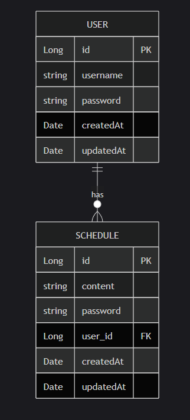
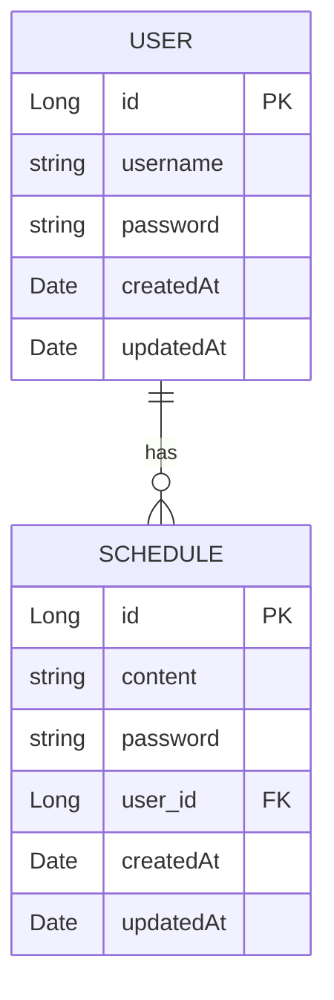

일정 관리 앱 API Specification
---

## 1 일정 관련 API

### 1.0 전체 API 리스트

| 기능       | Method | URL                         | request  | response  | status code |
|----------|--------|-----------------------------|----------|-----------|-------------|
| 일정 등록    | `POST` | /api/schedules              | 요청 Body  | 등록된 일정 정보 | 201 Created |
| 단건 일정 조회 | `GET`  | /api/schedules/{schedule_id} | 요청 param | 단건 일정 정보  | 200 OK |
| 다건 일정 조회 | `GET` | /api/schedules              | 요청 param | 다건 일정 정보  | 200 OK |
| 일정 수정 | `PUT` | /api/schedules/{schedule_id} | 요청 body  | 수정된 단건 일정 정보 | 200 OK | 
| 일정 삭제 | `DELETE` | /api/schedules/{schedule_id} | 요청 param | - | 200 OK |


### 1.1 일정 등록 API

+ 사용자 id와 일정의 비밀번호, 할 일의 내용을 입력받아 일정을 생성하는 api
+ Endpoint : `POST` /api/schedules

#### Request 형식(Form url Encoded Body) 

| 이름      | 위치   | 타입 | 필수 | 설명      |
|---------|------|---|---|---------|
| content | form |string|Y| 할 일의 내용 |
| username | form | 이름 | Y | 작성자 이름 |
| password | form | 비밀번호 | Y | 일정의 비밀번호 | 

#### Response 형식(json)

##### 성공 예시 `201 Created`
```json
{
  "scheduleId": 123,
  "content": "할 일의 내용",
  "username": "testUser",
  "createdAt": "20xx-xx-xx",
  "UpdatedAt": "20xx-xx-xx"
}
```

##### 실패 예시

+ 필수값 누락, 잘못된 요청(검증 등) `400 Bad Request`
```json
{
  "error" : "content는 필수 입력 항목입니다."
}
```


### 1.2 단건 일정 조회 API
+ 사용자의 id와, 일정의 비밀번호를 받아 단일 일정을 반환하는 api
+ Endpoint : `GET` /api/schedules/{schedule_id}?password=비밀번호

#### Request 요청
| 이름 | 위치 | 타입 | 필수 | 설명 |
|---|---|---|---|---|
|scedule_id|path|string|Y| 조회할 일정의 고유 ID |
|password|param| string|Y| 

#### 성공 예시 `200 OK`
```json
{
  "scheduleId": 123,
  "content": "할 일의 내용",
  "username": "testUser",
  "createdAt": "20xx-xx-xx",
  "updatedAt": "20xx-xx-xx"
}
```

#### 실패 예시 

+ `404_Not Found`
```json
{
  "error": "비밀번호가 일치하지 않습니다."
}
```
+ `400 Bad Request`
```json
{
  "error": "비밀번호를 입력하세요"
}
```

### 1.3 다건 일정 조회 API
+ 전체 일정 목록을 조회하는 API
+ Endpoint : `GET` /api/schedules

#### Request 요청
| 이름    | 위치   | 타입   | 필수 | 설명         |
|-------|------|------|-----|------------|
| passw | param | string | N   | 사용자 식별자(필터링용) |

#### 성공 예시 `200 OK`
```json
{
  "total": 2,
  "schedules": [
    {
      "scheduleId": 123,
      "content": "할 일의 내용",
      "username": "testUser",
      "createdAt": "20xx-xx-xx",
      "updatedAt": "20xx-xx-xx"
    },
    {
      "scheduleId": 124,
      "content": "다른 할 일",
      "username": "anotherUser",
      "createdAt": "20xx-xx-xx",
      "updatedAt": "20xx-xx-xx"
    }
  ]
}
```

---

### 1.4 일정 수정 API
+ 일정의 내용을 수정하는 API
+ Endpoint : `PUT` /api/schedules/{schedule_id}

#### Request 요청 (Form url Encoded Body)
| 이름      | 위치 | 타입   | 필수 | 설명         |
|---------|----|------|----|------------|
| content | body | string | N  | 수정할 내용     |
| username | body | string | N | 수정할 사용자 이름 정보 | 
| password| body | string | Y  | 일정의 비밀번호 |

#### 성공 예시 `200 OK`
```json
{
  "scheduleId": 123,
  "content": "수정된 내용",
  "username": "testUser",
  "createdAt": "20xx-xx-xx",
  "updatedAt": "20xx-xx-xx"
}
```

#### 실패 예시
+ `404 Not Found`
```json
{
  "error": "일정이 존재하지 않습니다."
}
```
+ `401 Unauthorized`
```json
{
  "error": "비밀번호가 일치하지 않습니다."
}
```
+ `400 Bad Request`
```json
{
  "error": "수정할 내용을 입력하세요."
}
```

---

### 1.5 일정 삭제 API
+ 일정을 삭제하는 API
+ Endpoint : `DELETE` /api/schedules/{schedule_id}?password=비밀번호

#### Request 요청
| 이름      | 위치 | 타입   | 필수 | 설명         |
|---------|----|------|-----|------------|
| password| param | string | Y   | 일정의 비밀번호 |

#### 성공 예시 `200 OK`
```json
{
  "message": "일정이 삭제되었습니다."
}
```

#### 실패 예시
+ `404 Not Found`
```json
{
  "error": "일정이 존재하지 않습니다."
}
```
+ `401 Unauthorized`
```json
{
  "error": "비밀번호가 일치하지 않습니다."
}
```
+ `400 Bad Request`
```json
{
  "error": "비밀번호를 입력하세요."
}
```

ER Diagram
---





> mermaid로 작성


